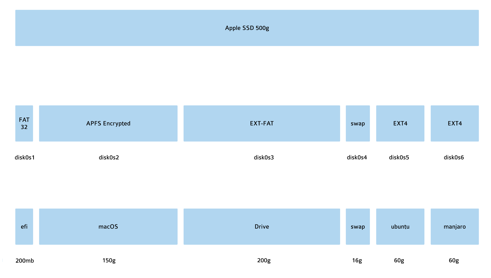

# Setting up a New Machine

## Steps

1. [Building the Partition Table](#Building-the-Partition-Table)
2. [Choosing a Platform](#Choosing-a-Platform)
3. [Forking the Dotfiles](#Forking-Brians-Dotfiles)
4. [Setting up the Environment](#Custom-Keybindings)

## Building the Partition Table

**Note:** This partition table is designed to accomodate several persistent OS's
with a local storage partition (Drive) visible in all. Drive is synced to
[Google Backup and Sync](https://www.google.com/drive/download/backup-and-sync/)
tool for cloud storage backup.

## Choosing a Platform

**[OS](https://en.wikipedia.org/wiki/Operating_system)**

1. [macOS Mojave](https://itunes.apple.com/us/app/macos-mojave/id1398502828?mt=12)
2. [Linux](https://www.linux.org/pages/download/)

### Choosing a Distribution

**[Distro](https://distrowatch.com/)**

1. [Ubuntu](https://www.ubuntu.com/#download)
2. [Kali](https://www.kali.org/downloads/)
3. [Arch](https://www.archlinux.org/download/)
4. [Manjaro](https://manjaro.org/download/)
5. [Debian](https://www.debian.org/distrib/)
6. [Mint](https://linuxmint.com/download.php)
7. [Peppermint](https://peppermintos.com/)
8. [Solus](https://getsol.us/download/)
9. [Elementary](https://elementary.io/nl/)

### Choosing a Kernel

**[Kernel](<https://en.wikipedia.org/wiki/Kernel_(operating_system)>)**

1. [Arch](https://wiki.archlinux.org/index.php/kernel)
2. [Manjaro](https://wiki.manjaro.org/index.php/Manjaro_Kernels)
3. [Ubuntu (bionic)](https://packages.ubuntu.com/bionic-updates/linux-image-4.15.0-34-generic)
4. [Darwin](<https://en.wikipedia.org/wiki/Darwin_(operating_system)>)

### Choosing a Desktop Environment

**[Flavor](https://en.wikipedia.org/wiki/Desktop_environment)**

1. [Deepin](https://www.deepin.org/en/download/)
2. [XFCE](https://www.xfce.org/download)
3. [Budgie](https://ubuntubudgie.org/)
4. [Mate](https://ubuntu-mate.org/download/)
5. [Cinnamin](https://linuxmint.com/edition.php?id=261)
6. [KDE Neon](https://neon.kde.org/download)
7. [Ubuntu Flavors](https://www.ubuntu.com/download/flavours)

### Choosing a Window Manager

**[WM](https://en.wikipedia.org/wiki/Window_manager)**

1. [i3](https://i3wm.org/downloads/)
2. [Deepin WM](https://github.com/linuxdeepin/deepin-wm)
3. [Quartz Compositor (Finder)](https://en.wikipedia.org/wiki/Quartz_Compositor)
4. [Muffin](https://github.com/linuxmint/muffin)
5. [Metacity (Marco)](https://github.com/mate-desktop/marco)

### Choosing a Package Manager

**[PM](https://en.wikipedia.org/wiki/Package_manager)**

1. [brew](https://brew.sh/)
2. [pip](https://pypi.org/project/pip/)
3. [npm](https://www.npmjs.com/get-npm)
4. [apt-get](https://itsfoss.com/apt-get-linux-guide/)

### Choosing a Shell

**[Shell](<https://en.wikipedia.org/wiki/Shell_(computing)>)**

1. [bash (5.0.7.1)](https://www.gnu.org/software/bash/)
2. [oh-my-zsh (5.7.1)](https://ohmyz.sh/)
3. [shell (3.2.57)](https://en.wikipedia.org/wiki/Comparison_of_command_shells)
4. [powershell (6.2.0)](https://github.com/PowerShell/PowerShell)
5. [gnome (2.0 | 3.30.2)](https://www.gnome.org/gnome-3/)
6. [unity (7.5)](<https://en.wikipedia.org/wiki/Unity_(user_interface)>)

### Choosing a Bootloader

**[Bootloader](https://wiki.osdev.org/Bootloader)**

1. [GRUB](https://www.gnu.org/software/grub/)
2. [rEFInd](https://www.rodsbooks.com/refind/)

## Forking Brians Dotfiles

**Note:** the hidden dotfiles folder will be cloned to the home directory.

1. type `git clone https://github.com/briancrink/.dotfiles.git ~/.dotfiles` to
   clone to the local home directory.
2. type `source ~/.dotfiles/.setup/.setup` to begin the setup process.
3. Once finished, type `reboot` to restart the machine.
4. Done.

## Custom Keybindings

### Terminal:

- press <kbd>⌘ Command</kbd>+<kbd>⇧ Shift</kbd>+<kbd>1</kbd> to **Select Menu**
  **Item.. Default**
- press <kbd>⌘ Command</kbd>+<kbd>⇧ Shift</kbd>+<kbd>2</kbd> to **Select Menu**
  **Item.. Joker**
- press <kbd>⌘ Command</kbd>+<kbd>⌥ Option</kbd>+<kbd>Space</kbd> to **Split**
  **Horizontally with Current Profile**
- press <kbd>⌘ Command</kbd>+<kbd>⌥ Option</kbd>+<kbd>N</kbd> to **Split**
  **Vertically with Current Profile**
- press <kbd>⌘ Command</kbd>+<kbd>N</kbd> to **Open New Tab**
- press <kbd>⌘ Command</kbd>+<kbd>P</kbd> to **Open Preferences**
- press <kbd>⌘ Command</kbd>+<kbd>⇧ Shift</kbd>+<kbd>→ Arrow</kbd> to **Select**
  **Next Tab**
- press <kbd>⌘ Command</kbd>+<kbd>⇧ Shift</kbd>+<kbd>← Arrow</kbd> to **Select**
  **Previous Tab**
- press <kbd>⌘ Command</kbd>+<kbd>⌥ Option</kbd>+<kbd>↑ Arrow</kbd> to
  **Select** **Split Pane Above**
- press <kbd>⌘ Command</kbd>+<kbd>⌥ Option</kbd>+<kbd>↓ Arrow</kbd> to
  **Select** **Split Pane Below**
- press <kbd>⌘ Command</kbd>+<kbd>⌥ Option</kbd>+<kbd>← Arrow</kbd> to
  **Select** **Split Pane Left**
- press <kbd>⌘ Command</kbd>+<kbd>⌥ Option</kbd>+<kbd>→ Arrow</kbd> to
  **Select** **Split Pane Right**

### Photoshop:

- type <kbd>⇧ Shift</kbd>+<kbd>⌘ Command</kbd>+<kbd>⌥ Option</kbd>+<kbd>E</kbd>
  to **merge all layers**
